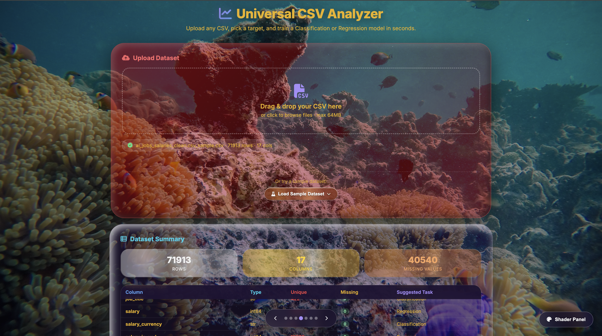
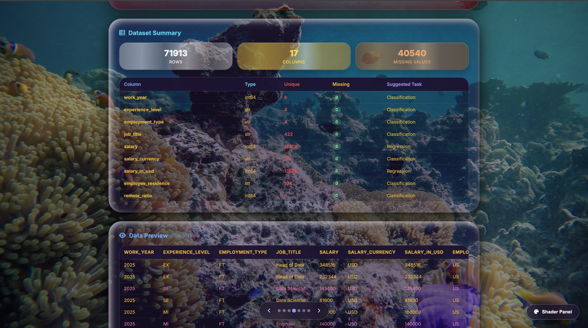
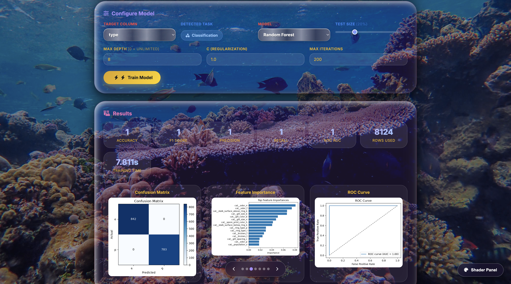
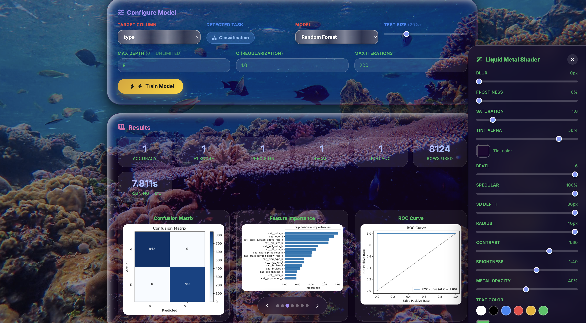

# 🧪 Universal CSV Analyzer

> A **Liquid Metal ML dashboard** that uploads any CSV, auto-detects classification or regression, and trains optimized scikit-learn models in under 5 seconds — all in the browser.

[](https://universal-csv-analyzer.onrender.com)
[](https://www.python.org/)
[](https://scikit-learn.org/)
[](https://flask.palletsprojects.com/)
[](https://www.docker.com/)

---

## 📸 Screenshots

### Full Dashboard — Liquid Metal UI


*Drag-and-drop CSV upload (up to 64 MB), sample dataset dropdown, and the Liquid Metal aesthetic — photorealistic metallic sub-cards in Chrome, Gold, and Bronze.*

### Dataset Summary & Profiling


*Auto-profiling on upload: dtypes, missing-value counts, unique values per column, and a preview of the first 10 rows with alternating row colors.*

### Training Results


*Model output rendered live: Accuracy / F1 / Precision / Recall for classification, R² / MSE / MAE for regression — plus Confusion Matrix, ROC Curve, Feature Importance, and Actual-vs-Predicted plots.*

### Liquid Metal Shader Panel


*Real-time control over the entire aesthetic: Blur, Frostiness, Saturation, Tint Alpha + Color, Bevel, Specular, 3D Depth, Contrast, Brightness, Metal Opacity, and Text Color.*

---

## ✨ Features

### 🧠 Ultra-Fast ML Training
- **Auto-drops useless columns** — IDs, names, URLs, near-unique text
- **Fast preprocessing** — `OneHotEncoder(sparse=True)` + `StandardScaler`
- **Automatic model selection** based on dataset size:
  - **>50k rows:** `SGDClassifier` / `SGDRegressor` (blazing fast)
  - **5k–50k rows:** `RandomForest` (balanced)
  - **<5k rows:** `SVC` / `SVR` (highest accuracy)
- **Downsampling** for >50k rows (to 20k) — guarantees sub-5s training
- **30-second hard timeout** — no infinite training hangs
- **Works on any dataset** — classification OR regression, auto-detected

### 📊 Data Analysis
- **Drag & drop CSV upload** — up to 64 MB
- **Automatic data profiling** — dtypes, missing counts, unique values
- **Raw data preview** — first 10 rows with alternating row colors
- **Target column auto-detection** — classification vs regression inferred from dtype and cardinality
- **Sample datasets** — mushrooms (classification) and student performance (regression) loadable via dropdown
- **Metrics** — Accuracy, F1, Precision, Recall, R², MSE, MAE
- **Charts** — Confusion Matrix, ROC Curve, Feature Importance, Actual vs Predicted

### 🎨 Liquid Metal UI
- **Photorealistic metallic sub-cards** — Chrome, Gold, Bronze gradients
- **Live shader panel**:
  - Blur, Frostiness, Saturation
  - Tint Alpha + Tint Color
  - Bevel, Specular, 3D Depth
  - Contrast, Brightness
  - **Metal Opacity slider** — smoothly transitions between gel glass and full metal
  - Text Color presets + custom picker
- **7 switchable backgrounds** — images and GIFs with crossfades
- **Fixed unique colors** for section titles — no more hunting for the right heading
- **Glassmorphism cards** with hover glow and 3D depth
- **Fully responsive** — mobile-friendly

---

## 🏗️ Architecture

```
User drops any CSV (up to 64 MB)
              │
              ▼
┌──────────────────────────────────┐
│  Profiling                       │
│  • dtypes, missing counts        │
│  • unique values per column      │
│  • auto-detect target column     │
└──────────────┬───────────────────┘
               │
               ▼
┌──────────────────────────────────┐
│  Cleaning                        │
│  • drop ID / name / URL cols     │
│  • drop near-unique text         │
│  • OneHotEncode categoricals     │
│  • StandardScale numerics        │
└──────────────┬───────────────────┘
               │
               ▼
┌──────────────────────────────────┐
│  Auto Model Selection            │
│                                  │
│   >50k rows → SGD                │
│   5k–50k    → Random Forest      │
│   <5k       → SVC / SVR          │
│                                  │
│   Classification vs Regression   │
│   inferred from target dtype     │
└──────────────┬───────────────────┘
               │
               ▼
┌──────────────────────────────────┐
│  Train + Evaluate                │
│  • 30s timeout guard             │
│  • metrics computed              │
│  • matplotlib charts rendered    │
└──────────────┬───────────────────┘
               │
               ▼
      JSON → Flask → Browser
               │
               ▼
    Liquid Metal dashboard renders
    metrics, charts, and profiling
    via inlined HTML/CSS/JS
```

**Backend:** Flask · scikit-learn · pandas · numpy · matplotlib
**Frontend:** Inlined HTML/CSS/JS · single-page Liquid Metal UI (no build step)
**Deployment:** Docker → Render

---

## 🛠️ Tech Stack

| Layer | Technology | Purpose |
|---|---|---|
| **Backend** | Python 3.11 | Runtime |
| **Web framework** | Flask 3.1 | REST API + HTML serving |
| **ML** | scikit-learn 1.9 | Auto model selection + training |
| **Data** | pandas · numpy | CSV parsing, cleaning, profiling |
| **Charts** | matplotlib | Confusion Matrix, ROC, Feature Importance |
| **Frontend** | HTML / CSS / vanilla JS | Liquid Metal single-page UI |
| **Icons** | Font Awesome 6.4 | UI iconography |
| **Deployment** | Docker → Render | Container build + free-tier hosting |

---

## 📊 Sample Datasets

Ships with two built-in datasets, loadable from the UI dropdown:

| Dataset | Task | Rows | Target |
|---|---|---|---|
| `mushrooms.csv` | Classification | 8,124 | `class` (edible / poisonous) |
| `student_performance_dataset.csv` | Regression | — | numeric performance score |

You can also upload **any** CSV — the app infers task type and picks a model automatically.

---

## 🚀 Local Setup

```bash
# 1. Clone
git clone https://github.com/olalekanijagbemi-VR/Universal_CSV_Analyzer.git
cd Universal_CSV_Analyzer

# 2. Create virtualenv
python3 -m venv venv
source venv/bin/activate        # On Windows: venv\Scripts\activate

# 3. Install dependencies
pip install -r requirements.txt

# 4. Run
python app.py
```

Open **http://127.0.0.1:5001**

No API keys required — everything runs locally.

---

## ☁️ Deployment (Render)

This repo ships with a `Dockerfile` — Render auto-detects it as Docker runtime.

1. Push to GitHub
2. Render → **New +** → **Web Service** → connect repo
3. Settings:
   - **Runtime:** Docker (auto-detected)
   - **Instance Type:** Free
   - **Environment Variables:** *(none required)*
4. Deploy

**Free tier caveats:**
- App sleeps after 15 min inactivity → ~50s cold start on first request
- Training runs in-process — 30s timeout protects against runaway jobs

---

## 🎯 Use Cases

- **Data Scientists** — quick model prototyping on any CSV, no boilerplate
- **Students** — visual feedback on classification vs regression and model selection
- **Business Analysts** — analyze sales/customer data without writing code
- **Educators** — demonstrate the full ML pipeline in a browser
- **Portfolio viewers** — see a full-stack ML app end-to-end

---

## 📁 Project Structure

```
Universal_CSV_Analyzer/
├── app.py                      # Flask backend + inlined HTML/CSS/JS
├── Dockerfile
├── requirements.txt
├── README.md
├── sample_data/                # Built-in sample CSVs
│   ├── mushrooms.csv
│   └── student_performance_dataset.csv
├── screenshots/                # README assets
│   ├── dashboard.png
│   ├── summary.png
│   ├── results.png
│   └── shader_panel.png
└── static/
    └── images/                 # 7 background images + GIFs
```

---

## 🎯 Roadmap

- [ ] Multi-file comparison — train on two CSVs side-by-side
- [ ] Hyperparameter tuning UI — grid search on demand
- [ ] Model export — download trained pickle for reuse
- [ ] Cross-validation — k-fold splits with variance reporting
- [ ] Auto-feature engineering — polynomial interactions, target encoding
- [ ] Exportable PDF report — one-click summary of results

---

## 📄 License

MIT — free for personal and commercial use.

---

## 🙌 Credits

Built by **Olalekan Ijagbemi** — [GitHub](https://github.com/olalekanijagbemi-VR) · [LinkedIn](https://linkedin.com/in/olalekan-ijagbemi-95a1b2269)

Third live deployment in the ML portfolio series.

---

## 🎯 More Projects

This is part of a 3-project ML portfolio:

1. **🍄 Mushroom ML Classifier**
   - [GitHub](https://github.com/olalekanijagbemi-VR/ML_With_Liquid_Glass_Dashboard) · [Live Demo](https://ml-with-liquid-glass-dashboard.onrender.com)
   - Classic ML classification with a Liquid Glass dashboard

2. **📊 Universal CSV Analyzer** ← *this repo*
   - [GitHub](https://github.com/olalekanijagbemi-VR/Universal_CSV_Analyzer) · [Live Demo](https://universal-csv-analyzer.onrender.com)
   - Automatic data profiling and visualization

3. **🎨 Metal Liquid RAG Assistant**
   - [GitHub](https://github.com/olalekanijagbemi-VR/Metal_Liquid_Dashboard-Rag_Assistant) · [Live Demo](https://metal-liquid-dashboard-rag-assistant.onrender.com)
   - Hybrid retrieval + voice I/O with a Liquid Metal UI